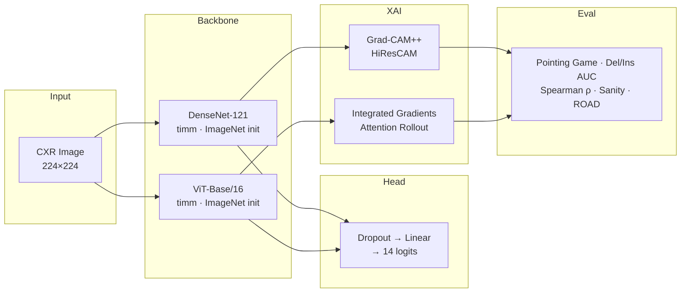

# CXR-XAI-Clinical

**Multi-label chest X-ray pathology classification on NIH ChestX-ray14 (14 classes, 112 K images) with four XAI methods evaluated across six quantitative faithfulness and stability metrics — demonstrating that visual plausibility and mathematical faithfulness of saliency maps are dissociated across CNN and Transformer architectures.**

> Framework: **PyTorch + timm** for 2D classification and gradient-level XAI control.
> MONAI is not used here because it targets volumetric 3D pipelines; full hook access
> to intermediate layers is required for Grad-CAM++ and HiResCAM.

---

## 1. Architecture



**Layer-wise LR decay** (decay factor 0.9 per group, outer → inner) is applied to both backbones.
**Mixed-precision** (AMP) is enabled throughout; minimum VRAM is 4 GB for DenseNet-121 at batch=16.

---

## 2. Results

Results will be populated after training completes. Placeholder columns match the paper-order XAI comparison table.

### 2a. Per-pathology AUROC on NIH ChestX-ray14 test set

| Pathology | DenseNet-121 | ViT-Base/16 | Wang et al. 2017 (reported) |
|---|---|---|---|
| Atelectasis | — | — | 0.7003 |
| Cardiomegaly | — | — | 0.8100 |
| Effusion | — | — | 0.7585 |
| Infiltration | — | — | 0.6614 |
| Mass | — | — | 0.6933 |
| Nodule | — | — | 0.6687 |
| Pneumonia | — | — | 0.6580 |
| Pneumothorax | — | — | 0.7993 |
| Consolidation | — | — | 0.7032 |
| Edema | — | — | 0.8052 |
| Emphysema | — | — | 0.8330 |
| Fibrosis | — | — | 0.7859 |
| Pleural Thickening | — | — | 0.6835 |
| Hernia | — | — | 0.8717 |
| **Macro AUROC** | **—** | **—** | **0.745** |

### 2b. XAI comparison table (DenseNet-121)

| Method | Pointing Game ↑ | Deletion AUC ↓ | Insertion AUC ↑ | Spearman ρ ↑ | Sanity ✓ | ROAD ↑ |
|---|---|---|---|---|---|---|
| Grad-CAM++ | — | — | — | — | — | — |
| HiResCAM | — | — | — | — | — | — |
| Integrated Gradients | — | — | — | — | — | — |
| Attention Rollout (ViT) | — | — | — | — | — | — |

---

## 3. Reproduce in three commands

```bash
# 1. Download NIH ChestX-ray14 (CC0 license, ~45 GB)
bash scripts/download_data.sh

# 2. Train
docker compose -f docker/docker-compose.yml up train

# 3. Evaluate (generates heatmaps + XAI comparison table)
bash scripts/run_experiments.sh --model densenet121
```

Or without Docker:

```bash
pip install -r requirements.txt
python scripts/train.py --config configs/train.yaml --model densenet121
python scripts/evaluate.py --config configs/eval.yaml --checkpoint results/checkpoints/best_densenet121.pt --model densenet121
```

**Debug run** (20 K subset, 2 epochs, ~5 min on CPU):

```bash
python scripts/train.py --config configs/train.yaml --debug
```

---

## 4. Data access

| Dataset | License | Size | Download |
|---|---|---|---|
| NIH ChestX-ray14 | CC0 (public domain) | ~45 GB, 112 120 images | `bash scripts/download_data.sh` |
| CheXpert val set | Stanford DUA (free registration) | 200 images | [stanfordmlgroup.github.io](https://stanfordmlgroup.github.io/competitions/chexpert/) |
| NIH BBox annotations | CC0 | Included with ChestX-ray14 | Same download script |

> **No raw dataset files are committed to this repository.** The `data/` directory is listed in `.gitignore`.
> Run `bash scripts/download_data.sh` to populate `data/NIH-ChestX-ray14/` automatically.

---

## 5. Limitations and intended use

- **Not validated for clinical deployment.** All models are research prototypes trained on a single dataset split. Performance on out-of-distribution scanners, patient populations, or acquisition protocols is unknown.
- **NIH ChestX-ray14 label noise.** Labels are extracted from radiology reports via NLP and have an estimated error rate of 10–20% per pathology. AUROC numbers reflect this ceiling.
- **XAI faithfulness ≠ clinical correctness.** A high Pointing Game score means the model attends to the radiologically labelled region, not that the clinical reasoning is sound.
- **No tabular metadata branch.** Age, sex, and view position are available in ChestX-ray14 but excluded from this phase. A SHAP metadata branch is planned for Phase 5.
- **GPU recommended.** Full training requires a GPU with ≥4 GB VRAM. CPU-only inference is supported for XAI generation and the Streamlit demo.

---

## 6. Citation

If you use this code or results in your work, please cite:

```bibtex
@software{amini2026cxrxai,
  author    = {Amini, Saeed},
  title     = {{CXR-XAI-Clinical}: Explainable {AI} for Chest {X-Ray} Pathology Classification},
  year      = {2026},
  url       = {https://github.com/saeed-amini/cxr-xai-clinical},
  version   = {0.1.0},
  license   = {MIT}
}
```

---

## 7. Related work

| Paper | Contribution | Relevance |
|---|---|---|
| Wang et al. (2017) — *ChestX-ray8* | First large-scale multi-label CXR dataset and DenseNet-121 baseline | Establishes our benchmark and architecture |
| Selvaraju et al. (2017) — *Grad-CAM* | Class Activation Mapping via gradients | Foundation for Grad-CAM++ and HiResCAM |
| Draelos & Carin (2020) — *HiResCAM* | Mathematically faithful CAM variant | Grad-CAM++ is visually smoother; HiResCAM is provably faithful |
| Abnar & Zuidema (2020) — *Attention Rollout* | Propagates attention across ViT layers | Enables spatial XAI for the ViT backbone |
| Adebayo et al. (2018) — *Sanity Checks for Saliency Maps* | Cascading weight randomization test | Justifies our sanity check metric; many saliency methods fail it |
| Hedström et al. (2023) — *Quantus* | Unified XAI evaluation library | Provides our ROAD faithfulness metric |

---

## Repository structure

```
cxr-xai-clinical/
├── configs/
│   ├── train.yaml          # all training hyperparameters
│   ├── eval.yaml           # evaluation + XAI metric settings
│   └── model/              # per-model config with framework rationale
├── src/
│   ├── data/               # NIH14Dataset, CheXpert, RSNA, transforms
│   ├── models/             # CXRClassifier (timm wrapper) + LR decay
│   ├── training/           # Trainer, checkpoint, WandB logger, loss
│   ├── xai/                # Grad-CAM++, HiResCAM, IG, Attention Rollout
│   └── evaluation/         # pointing game, deletion/insertion, ROAD, etc.
├── scripts/
│   ├── train.py
│   ├── generate_xai.py
│   ├── evaluate.py
│   ├── download_data.sh
│   └── run_experiments.sh
├── tests/                  # 50+ pytest tests (dataset, models, XAI)
├── demo/app.py             # Streamlit inference demo
└── docker/                 # multi-stage Dockerfile (train GPU / demo CPU)
```
