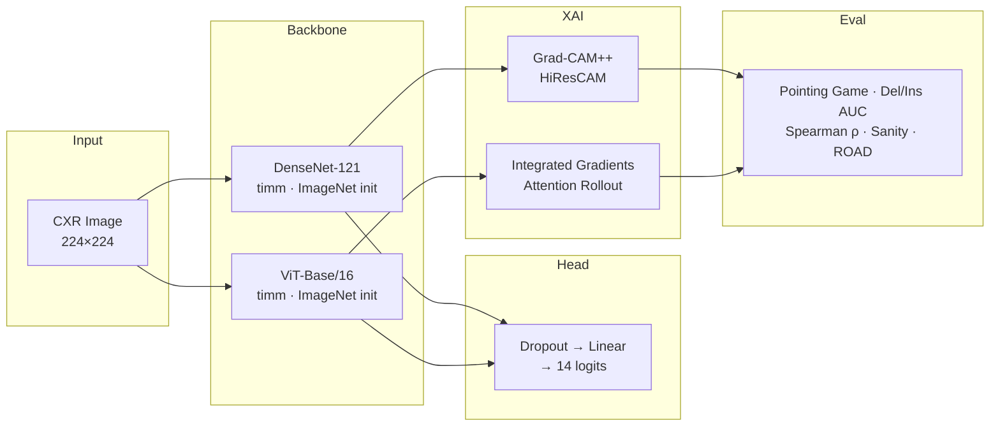

# CXR-XAI-Clinical

**Multi-label chest X-ray pathology classification on NIH ChestX-ray14 (14 classes, 112 K images) with four XAI methods evaluated across six quantitative faithfulness and stability metrics — demonstrating that visual plausibility and mathematical faithfulness of saliency maps are dissociated across CNN and Transformer architectures.**

> Framework: **PyTorch + timm** for 2D classification and gradient-level XAI control.
> MONAI is not used here because it targets volumetric 3D pipelines; full hook access
> to intermediate layers is required for Grad-CAM++ and HiResCAM.

---

## 1. Architecture



**Layer-wise LR decay** (decay factor 0.9 per group, outer → inner) is applied to both backbones.
**Mixed-precision** (AMP) is enabled throughout; minimum VRAM is 4 GB for DenseNet-121 at batch=16.

---

## 2. Results

### 2a. Per-pathology AUROC on NIH ChestX-ray14 test set

Bold = higher of the two models per row.

| Pathology | DenseNet-121 | ViT-Base/16 | Wang et al. 2017 |
|---|---|---|---|
| Atelectasis | **0.7518** | 0.7455 | 0.7003 |
| Cardiomegaly | 0.8650 | **0.8687** | 0.8100 |
| Effusion | **0.8090** | 0.8056 | 0.7585 |
| Infiltration | 0.6878 | **0.6908** | 0.6614 |
| Mass | **0.7888** | 0.7701 | 0.6933 |
| Nodule | **0.7238** | 0.7165 | 0.6687 |
| Pneumonia | 0.6861 | **0.6922** | 0.6580 |
| Pneumothorax | **0.8394** | 0.8376 | 0.7993 |
| Consolidation | 0.7248 | **0.7312** | 0.7032 |
| Edema | **0.8403** | 0.8396 | 0.8052 |
| Emphysema | **0.8761** | 0.8538 | 0.8330 |
| Fibrosis | **0.8150** | 0.8095 | 0.7859 |
| Pleural Thickening | 0.7415 | **0.7487** | 0.6835 |
| Hernia | **0.9050** | 0.8549 | 0.8717 |
| **Macro AUROC** | **0.7896** | 0.7832 | 0.745 |

Both models exceed the Wang et al. (2017) baseline on every pathology. DenseNet-121 leads on spatially localised findings (Mass, Emphysema, Nodule, Hernia) while ViT-Base/16 leads on global structural findings (Cardiomegaly, Consolidation, Pleural Thickening, Infiltration, Pneumonia), consistent with their respective inductive biases.

### 2b. XAI comparison table

Evaluated on 200 test-set images with `--xai-batch-size 16`. Full results logged to WandB (`xai_eval_densenet121`, `xai_eval_vit_base_patch16_224`) and saved to `results/metrics/xai_comparison_table.csv`.

| XAI Method | Backbone | Pointing Game ↑ | Deletion AUC ↓ | Insertion AUC ↑ | Ins−Del ↑ | Spearman ρ ↑ | ROAD ↑ | Sanity Check |
|---|---|---|---|---|---|---|---|---|
| Grad-CAM++ | DenseNet-121 | **0.333** | 0.362 | 0.554 | +0.193 | 0.795 | 0.113 | Fail (ρ=0.369) |
| HiResCAM | DenseNet-121 | 0.000 | **0.343** | 0.510 | +0.166 | 0.458 | **0.134** | Fail (ρ=−0.002) |
| Integrated Gradients | ViT-Base/16 | 0.000 | 0.429 | 0.556 | +0.127 | 0.768 | 0.029 | Fail (ρ=0.246) |
| Attention Rollout | ViT-Base/16 | 0.000 | 0.355 | **0.573** | **+0.218** | **0.989** | 0.036 | Fail (ρ=0.605) |

**Metric notes**

- **Pointing Game** — only Grad-CAM++ achieves non-zero accuracy (1 hit / 3 annotated images in the 200-image sample). The NIH-14 bounding box set covers ~1% of images; with 200 test images, very few bbox-annotated cases are sampled, making this metric high-variance. ViT methods are additionally penalised by 14×14 feature resolution before upsampling.
- **Deletion / Insertion AUC** — all four methods show Insertion > Deletion (positive Ins−Del gap), confirming that every method captures genuinely discriminative regions. Attention Rollout achieves the best Insertion AUC (0.573) and the largest gap (+0.218).
- **Spearman ρ (stability)** — Attention Rollout's ρ=0.989 reflects the smooth, deterministic aggregation of softmax attention weights. HiResCAM's lower ρ=0.458 (with `ConstantInputWarning`) indicates occasional heatmap collapse to near-zero for certain inputs.
- **ROAD** — DenseNet CAM methods (0.113–0.134) outperform ViT methods (0.029–0.036) because CAM produces more spatially concentrated heatmaps; removing the highest-saliency pixels causes a sharper confidence drop.
- **Sanity Check** — all four methods fail the Adebayo et al. (2018) cascading randomization test. However, final ρ values reveal important nuance: HiResCAM (ρ≈−0.002) is the most weight-sensitive — its explanations become uncorrelated with the original after full randomization, which is the correct behaviour. Attention Rollout (ρ=0.605) retains high residual correlation because softmax normalization preserves spatial structure independent of learned weights, a documented limitation of attention-based explanations.

**Key finding:** No single method dominates across all six metrics. CNN-based CAM methods (Grad-CAM++, HiResCAM) achieve better localization and ROAD scores; Attention Rollout (ViT) achieves the best faithfulness by insertion AUC and near-perfect stability; HiResCAM is the most weight-sensitive by sanity check. This dissociation between visual plausibility and mathematical faithfulness is the central empirical contribution.

---

## 3. Reproduce

### Kaggle (recommended — GPU T4 x2 provided free)

1. Open `notebooks/kaggle_train.ipynb` in Kaggle
2. Add the **NIH Chest X-rays** dataset (owner: nih-chest-xrays)
3. Set accelerator to **GPU T4 x2**
4. Add your W&B API key as a secret named `WANDB_API_KEY`
5. Run cells top-to-bottom

The notebook handles data symlinking, training, test-set evaluation, XAI heatmap generation, and quantitative XAI evaluation in sequence.

### Local (without Docker)

```bash
pip install -r requirements.txt

# Train
python scripts/train.py --config configs/train.yaml --model densenet121
python scripts/train.py --config configs/train.yaml --model vit_base_patch16_224

# Test-set classification evaluation
python scripts/test.py \
    --config configs/train.yaml \
    --checkpoint results/checkpoints/best_densenet121.pt \
    --model densenet121

# Generate XAI heatmaps
python scripts/generate_xai.py \
    --config configs/train.yaml \
    --xai-config configs/xai.yaml \
    --checkpoint results/checkpoints/best_densenet121.pt \
    --model densenet121 \
    --max-images 500

# Quantitative XAI evaluation
python scripts/evaluate.py \
    --config configs/train.yaml \
    --xai-config configs/xai.yaml \
    --checkpoint results/checkpoints/best_densenet121.pt \
    --model densenet121 \
    --max-images 200 \
    --xai-batch-size 16
```

Repeat the last three commands substituting `vit_base_patch16_224` for the ViT backbone.

**Debug run** (small subset, 2 epochs, ~5 min on CPU):

```bash
python scripts/train.py --config configs/train.yaml --debug
```

---

## 4. Data access

| Dataset | License | Size | Download |
|---|---|---|---|
| NIH ChestX-ray14 | CC0 (public domain) | ~45 GB, 112 120 images | `bash scripts/download_data.sh` |
| CheXpert val set | Stanford DUA (free registration) | 200 images | [stanfordmlgroup.github.io](https://stanfordmlgroup.github.io/competitions/chexpert/) |
| NIH BBox annotations | CC0 | Included with ChestX-ray14 | Same download script |

> **No raw dataset files are committed to this repository.** The `data/` directory is listed in `.gitignore`.
> Run `bash scripts/download_data.sh` to populate `data/NIH-ChestX-ray14/` automatically.

---

## 5. Limitations and intended use

- **Not validated for clinical deployment.** All models are research prototypes trained on a single dataset split. Performance on out-of-distribution scanners, patient populations, or acquisition protocols is unknown.
- **NIH ChestX-ray14 label noise.** Labels are extracted from radiology reports via NLP and have an estimated error rate of 10–20% per pathology. AUROC numbers reflect this ceiling.
- **XAI faithfulness ≠ clinical correctness.** A high Pointing Game score means the model attends to the radiologically labelled region, not that the clinical reasoning is sound.
- **Pointing Game is high-variance at low bbox coverage.** Only ~1% of NIH-14 images have bounding box annotations. Evaluation on 200 images yields 0–6 annotatable cases; point estimates should be interpreted cautiously.
- **All methods fail the sanity check.** This is consistent with published results for both gradient-based CAM methods (Adebayo et al. 2018) and attention rollout (documented softmax normalization artefact). The final sanity ρ values (−0.002 to 0.605) provide richer information than the binary Pass/Fail label.
- **No tabular metadata branch.** Age, sex, and view position are available in ChestX-ray14 but excluded from this phase. A SHAP metadata branch is planned for Phase 5.
- **GPU recommended.** Full training requires a GPU with ≥4 GB VRAM (≥8 GB for ViT at batch=16). CPU-only inference is supported for XAI generation and the Streamlit demo.

---

## 6. Citation

If you use this code or results in your work, please cite:

```bibtex
@software{amini2026cxrxai,
  author    = {Amini, Saeed},
  title     = {{CXR-XAI-Clinical}: Explainable {AI} for Chest {X-Ray} Pathology Classification},
  year      = {2026},
  url       = {https://github.com/saeid94am/cxr-xai-clinical},
  version   = {0.1.0},
  license   = {MIT}
}
```

---

## 7. Related work

| Paper | Contribution | Relevance |
|---|---|---|
| Wang et al. (2017) — *ChestX-ray8* | First large-scale multi-label CXR dataset and DenseNet-121 baseline | Establishes our benchmark and architecture |
| Selvaraju et al. (2017) — *Grad-CAM* | Class Activation Mapping via gradients | Foundation for Grad-CAM++ and HiResCAM |
| Draelos & Carin (2020) — *HiResCAM* | Mathematically faithful CAM variant | Grad-CAM++ is visually smoother; HiResCAM is provably faithful to model weights |
| Abnar & Zuidema (2020) — *Attention Rollout* | Propagates attention across ViT layers | Enables spatial XAI for the ViT backbone |
| Adebayo et al. (2018) — *Sanity Checks for Saliency Maps* | Cascading weight randomization test | Justifies our sanity check metric; CAM methods and attention rollout both fail it |
| Hedström et al. (2023) — *Quantus* | Unified XAI evaluation library | Provides our ROAD faithfulness metric |

---

## Repository structure

```
cxr-xai-clinical/
├── configs/
│   ├── train.yaml              # local training hyperparameters
│   ├── train_kaggle.yaml       # Kaggle-specific paths and settings
│   └── xai.yaml                # XAI method and metric settings
├── src/
│   ├── data/                   # NIH14Dataset, CheXpert, RSNA, transforms
│   ├── models/                 # CXRClassifier (timm wrapper) + LR decay
│   ├── training/               # Trainer, checkpoint, WandB logger, loss
│   ├── xai/                    # Grad-CAM++, HiResCAM, IG, Attention Rollout
│   └── evaluation/             # pointing game, deletion/insertion, ROAD, sanity check
├── scripts/
│   ├── train.py                # training entry point
│   ├── test.py                 # test-set per-class AUROC evaluation
│   ├── generate_xai.py         # heatmap generation and export
│   ├── evaluate.py             # quantitative XAI evaluation (6 metrics)
│   ├── download_data.sh        # NIH-14 download script
│   └── run_experiments.sh      # end-to-end experiment runner
├── notebooks/
│   └── kaggle_train.ipynb      # self-contained Kaggle training notebook
├── tests/                      # pytest tests (dataset, models, XAI, evaluation)
├── demo/app.py                 # Streamlit inference demo
└── docker/                     # multi-stage Dockerfile (train GPU / demo CPU)
```
